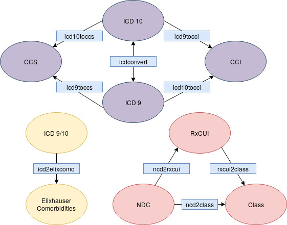

# I2BMI
Biomedical Informatics toolkit by Institute for Informatics at Washington University School of Medicine in St. Louis

This package provides tools for converting medical data between different formats. Here is a diagram showing which function to use, based on the source and destination formats:

